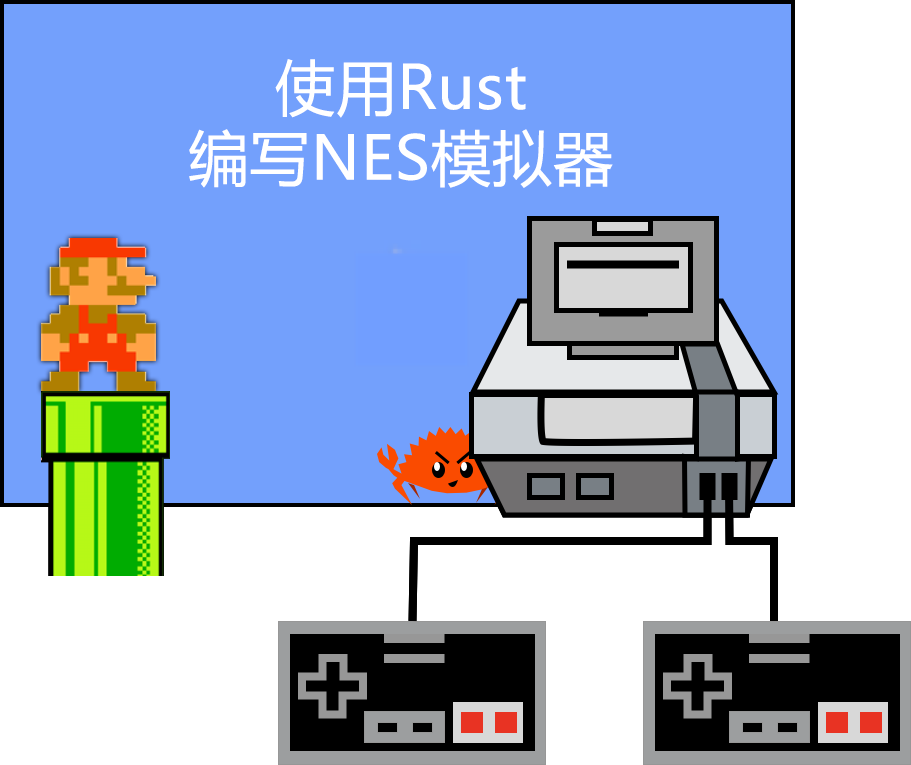

# 为什么是NES?

[NES](https://en.wikipedia.org/wiki/Nintendo_Entertainment_System)（任天堂娱乐系统）是整个80 年代和 90 年代最受欢迎的游戏平台之一。平台和涌现的生态系统过去和现在都是一个巨大的文化现象。该设备本身具有相对简单的硬件（从现代来看），更令人难以置信的是它的制造量。

本系列是关于创建一个能够运行和玩第一代 NES 游戏的模拟器，例如：
- [PacMan](https://en.wikipedia.org/wiki/Pac-Man)
- [Donkey Kong](https://en.wikipedia.org/wiki/Donkey_Kong)
- [Ice Climber](https://en.wikipedia.org/wiki/Ice_Climber)
- [Super Mario Bros](https://en.wikipedia.org/wiki/Super_Mario_Bros)
- 等等

我们将进行增量更新，可能会带来令人愉快的里程碑，逐步构建一个功能齐全的平台。编写模拟器的问题之一是，直到整个事情完成后，您才得到一些反馈，这并不好玩。我试图将整个练习分解成具有可见和可玩目标的小块。毕竟，一切都是为了玩得开心。

# 为什么选Rust?

Rust 是一种现代语言，具有现代表达能力和令人印象深刻的性能特征。

> 有关该语言的概述，我建议观看Jon Gjengse的["Consider Rust"](https://www.youtube.com/watch?v=DnT-LUQgc7s) 演讲。

Rust 编程语言允许我们在硬件和内存管理方面尽可能底层，这非常适合硬件模拟问题。例如，NES 有一个中央处理单元 (CPU)，大多数支持的操作都是处理无符号 8 位算术和位操作。Rust 提供了出色的功能来处理不同大小的有符号和无符号数字，而无需任何开销。此外，Rust 生态系统提供了大量的库，使处理位级数据变得尽可能方便。

目标是在我们拥有的硬件上玩 NES 游戏，这意味着我们必须模拟 NES 硬件。仅模拟过程就意味着与运行本机应用程序相比，我们引入了显着的性能开销。通过选择 rust，我们希望获得一些额外的性能预算来满足我们的需求。按照今天的标准，NES 硬件规格相当适中。例如，NES CPU 比现代 CPU 慢约 3000 倍。用任何语言模拟应该不是问题。有些人能够在用 Python 编写的模拟器上获得可玩的性能。但是免费拥有额外的性能仍然很好。

# 先决条件

我希望读者具备 Rust 语言的基本知识，并了解主要的语言结构和平台功能。我将在我们进行的过程中介绍一些功能，但其他功能必须在其他地方学习。

还假设读者对位算术、布尔逻辑以及二进制和十六进制编号系统的工作原理有基本的了解。同样，NES 是一个相对简单的平台，NES CPU 指令集小而简单，但需要对计算机系统有一些基本了解。

# 引用

1. [Nesdev Wiki](http://wiki.nesdev.com/w/index.php/Nesdev_Wiki) - 没有它，一切都将是不可能的。一站式服务。
2. [Nintendo Entertainment System Documentation](http://nesdev.com/NESDoc.pdf) - 一个简短的教程，几乎涵盖了有关 NES 的所有内容
3. [Nintendo Age Nerdy Nights](https://nerdy-nights.nes.science/) - 帮助人们为 NES 编写游戏的系列
4. [I.Am.Error](https://www.goodreads.com/book/show/23461364-i-am-error) - 一本充满任天堂娱乐系统平台历史的书
5. [The Elements of Computing Systems](https://www.goodreads.com/book/show/910789.The_Elements_of_Computing_Systems) - 你需要知道的关于计算机系统的一切，如何从逻辑门开始构建俄罗斯方块。

-------

Created by [@bugzmanov](http://twitter.com/bugzmanov), 2020

<em> Special thanks to [Spencer Burris](https://github.com/sburris0) and [Kirill Gusakov](https://github.com/kgusakov/) for reviews, edits and helpfull suggestions! </em>
