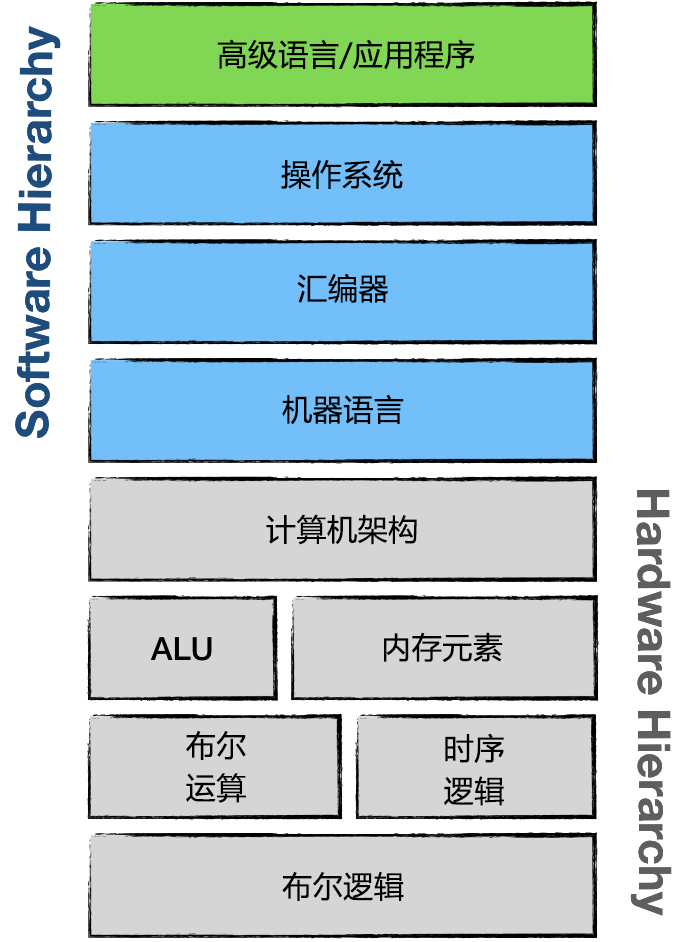

# NES平台
## 架构

软硬件交互的简化架构如下所示：

从上到下：
* 应用程序正在运行业务逻辑并通过操作系统与硬件交互。
* 操作系统使用机器语言与硬件通信。
* 在硬件级别上，每个设备都可以看作是一组存储元件、处理单元或两者兼而有之。从这个角度来看，NES 手柄无非是一个由 8 个 1 位项组成的数组，每个项代表一个按钮的按下/释放状态
* 我们对 ALU 和内存元素下面的层不太感兴趣。在硬件层面上，这一切都归结为逻辑门及其安排。

> 如果你想深入了解计算机是如何组成的，从布尔逻辑的基本原理开始，我强烈推荐这本书：  <a href="https://www.goodreads.com/book/show/910789.The_Elements_of_Computing_Systems">《计算系统组成。从第一原理构建现代计算机》</a> 作者是 Noam Nisan，Shimon Schocken。

幸运的是，NES 没有操作系统。这意味着应用层 (Gamezzz) 直接使用机器语言与硬件进行通信。

这种分层架构的简化版本如下所示：

如您所见，机器语言是我们的模拟器和我们的 NES 游戏之间的接口。

在即将到来的模拟器中，我们需要实现 NES 计算机体系结构、算术逻辑单元和内存。通过使用高级语言，我们无需担心模拟布尔算术和时序逻辑。相反，我们应该依赖现有的 Rust 特性和语言结构。

## NES平台主要组件

NES主要硬件组件的显着简化架构：

 * 中央处理器 (**CPU**) - NES的2A03是[6502 chip](https://en.wikipedia.org/wiki/MOS_Technology_6502)的修改版本。与任何 CPU 一样，该模块的目标是执行主程序指令。

图片处理单元 (**PPU**) - 基于制造 CPU 的同一家公司 Ricoh 制造的 2C02 芯片。该模块的主要目标是在电视屏幕上绘制游戏的当前状态。

CPU 和 PPU 都可以访问它们的 2 KiB（2048 字节）随机存取存储器 (**RAM**)组

音频处理单元 (**APU**) - 该模块是 2A03 芯片的一部分，负责生成特定的基于五通道的声音，这使得 NES 的芯片音乐很有辨识度。

* 卡带 - 是平台的重要组成部分，因为控制台没有操作系统。每个卡带至少带有两个大型 ROM 芯片——字符 ROM (CHR ROM) 和程序 ROM (PRG ROM)。前者存储游戏的视频图形数据，后者存储 CPU 指令——游戏的代码。（实际上，当卡带插入插槽时，CHR Rom 直接连接到 PPU，而 PRG Rom 直接连接到 CPU）更高版本的卡带带有额外的硬件（ROM 和 RAM），可通过所谓的映射器访问。这就解释了为什么尽管在相同的控制台硬件上运行，后来的游戏却提供了明显更好的游戏玩法和视觉效果。

* 游戏手柄 - 有一个明确的目标，即读取游戏玩家的输入并使其可用于游戏逻辑。正如我们稍后将看到的，8 位平台的游戏手柄只有八个按钮这一事实并非巧合。

有趣的是CPU、PPU和APU是相互独立的。这一事实使 NES 成为一个分布式系统，其中单独的组件必须协调才能产生无缝的游戏体验。

我们可以使用主要 NES 组件的模式作为我们模拟器的实现计划。

我们必须构建所有这些模块的模拟。目标是尽快有一些可玩的东西。使用迭代方法，我们将逐步添加功能以实现此目标。

粗略估计每个组件所需的工作量，PPU 将是最难的，而 BUS 是最简单的。

编写一个完美的模拟器是一个永无止境的追求。但是这个任务有一个开始，我们将从模拟 CPU 开始。

